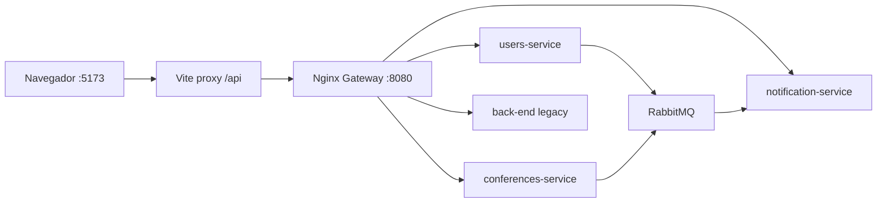
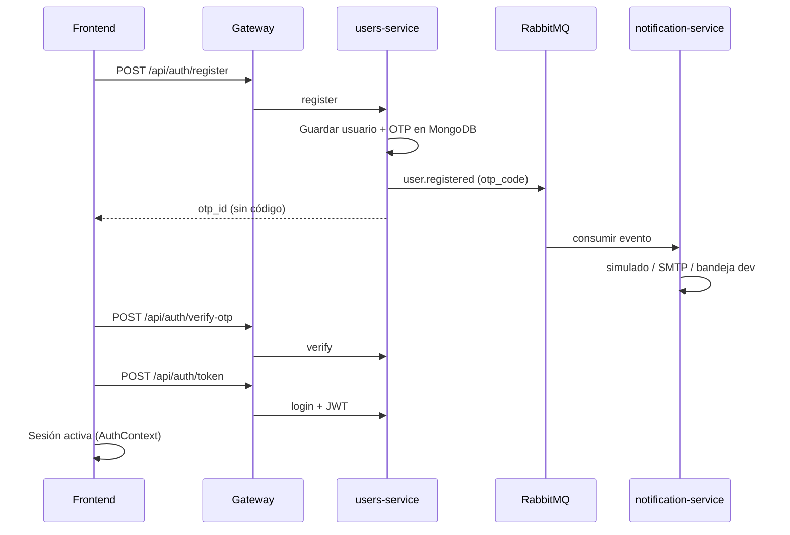

# Arquitectura del sistema CONIITI

Documento de referencia sobre componentes, flujos y despliegue. Para variables de entorno ver [VARIABLES_ENTORNO.md](./VARIABLES_ENTORNO.md).

## Vista general

El monorepo implementa una **arquitectura de microservicios** con un único punto de entrada HTTP para el frontend:



| Capa | Tecnología | Responsabilidad |
|------|------------|-----------------|
| Presentación | React 18 + Vite + TypeScript | UI, estado, llamadas a `/api` |
| Borde | Nginx (`nginx.conf`) | CORS, enrutamiento, health agregado |
| Dominio | FastAPI (varios servicios) | Auth, conferencias, notificaciones |
| Mensajería | RabbitMQ (topic `coniiti.events`) | Desacoplar registro OTP y eventos |
| Persistencia | MongoDB (por servicio) + SQLite (notificaciones) | Datos aislados por bounded context |

---

## Microservicios

### users-service (puerto interno 8000)

- Registro, login JWT, OTP, CRUD usuarios.
- MongoDB: `users_db` (`users`, `otps`).
- Publica `user.registered` y `user.otp_resent` con el código OTP en el payload (solo por RabbitMQ, no en la respuesta HTTP).

### conferences-service (puerto interno 8000)

- Conferencias y agenda del estudiante (`/student-agenda`).
- MongoDB: `conferences_db`.
- Publica `conference.created` (extensible a recordatorios).

### notification-service (puerto interno 8002)

- Consume eventos `user.*` y `conference.*`.
- Envía correos (modo `simulado`, SMTP o Mailpit).
- Persiste eventos procesados y bandeja dev (SQLite).

### back-end (legacy, puerto interno 8000)

- Rutas históricas aún no migradas; el gateway envía el resto de `/api/*` aquí.
- MongoDB: `produccion_db`.
- Objetivo: vaciar este servicio conforme se migren endpoints.

---

## Enrutamiento del gateway (Nginx)

| Prefijo público | Servicio destino |
|-----------------|------------------|
| `/api/auth/*` | users-service |
| `/api/users/*` | users-service |
| `/api/conferences/*` | conferences-service |
| `/api/student-agenda/*` | conferences-service |
| `/api/notifications/*` | notification-service |
| `/api/health/users` | users-service `/health` |
| `/api/health/conferences` | conferences-service `/health` |
| `/api/health/notifications` | notification-service `/health` |
| `/api/health/backend` | back-end `/health` |
| `/api/*` (resto) | back-end legacy |

El frontend **no** debe conocer puertos internos; solo `VITE_API_URL=/api`.

---

## Flujo de registro y OTP



En desarrollo, el OTP visible se obtiene por:

- Banner en `/auth` (`VITE_DEV_OTP_MAILBOX=true`), o
- `GET /api/notifications/dev/mailbox/latest?email=...`, o
- Mailpit en http://localhost:8025 si `NOTIFICATION_MODE=smtp`.

---

## Observabilidad

- **Logs:** formato JSON (`timestamp`, `level`, `service`, `message`) en cada microservicio.
- **Health:** `GET /health` por servicio; panel en `/system-health` del frontend.
- **Métricas notificaciones:** `GET /api/notifications/metrics` (`processed_events_total`).

---

## Despliegue

| Entorno | Herramienta | Documentación |
|---------|-------------|---------------|
| Local integrado | Docker Compose | [README.md](../README.md) |
| Orquestación K8s | Manifiestos en `k8s/` | [k8s/README.md](../k8s/README.md) |
| CI | GitHub Actions | `.github/workflows/ci.yml` |
| CD | Staging (`develop`) / Production (`main`) | `deploy-staging.yml`, `deploy-production.yml` |

---

## Estructura del repositorio (resumen)

```
produccion-proyect/
├── front-end/           # SPA React
├── users-service/       # Auth + usuarios
├── conferences-service/ # Conferencias + agenda
├── notification-service/
├── back-end/            # Legacy
├── api-gateway/         # Gateway FastAPI (opcional)
├── nginx.conf           # Gateway Nginx (Compose)
├── docker-compose.yml
├── docs/                # Documentación consolidada
└── k8s/                 # Kubernetes
```

---

## Documentos relacionados

- [VARIABLES_ENTORNO.md](./VARIABLES_ENTORNO.md)
- [ENTREGABLE_FINAL.md](./ENTREGABLE_FINAL.md)
- [GITFLOW.md](./GITFLOW.md)
- [INTEGRATION_GUIDE.md](../INTEGRATION_GUIDE.md)
