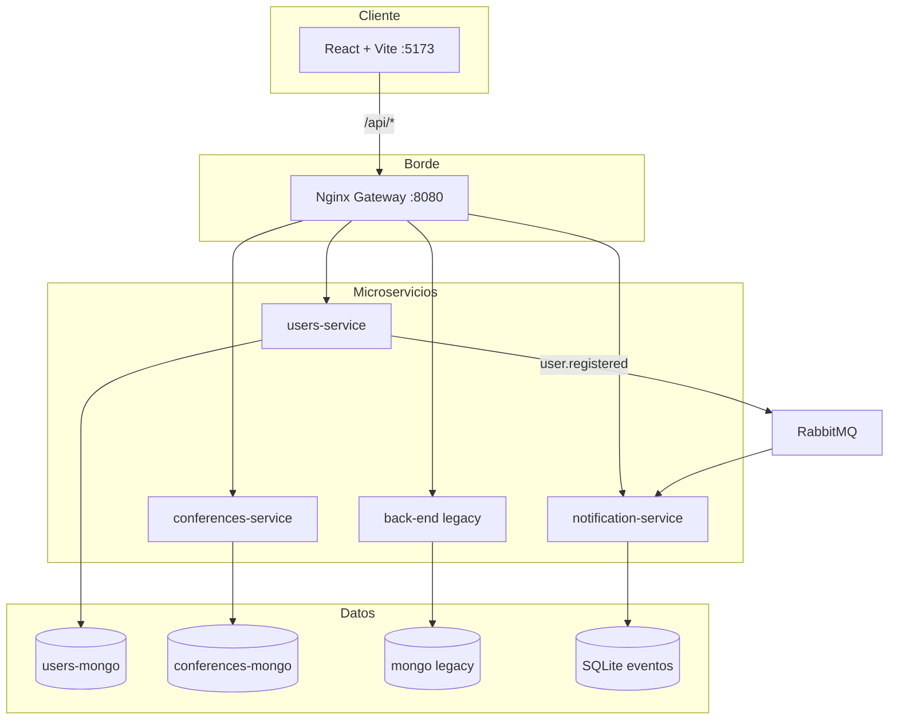
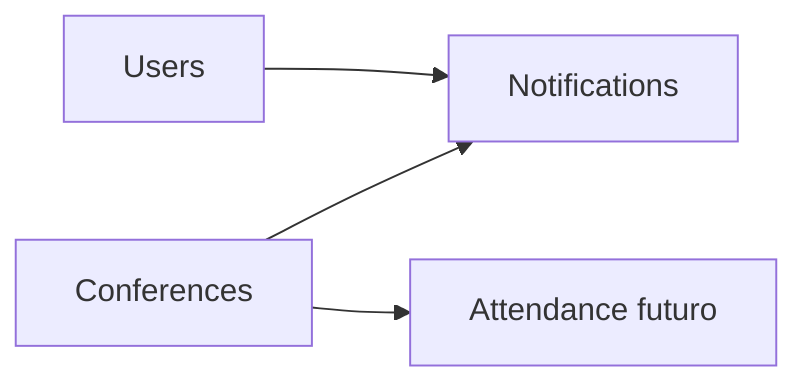

# Documento final consolidado — CONIITI

**Repositorio:** [github.com/MaicolRojas55/produccion-proyect](https://github.com/MaicolRojas55/produccion-proyect)  
**Versión:** 1.0 · Mayo 2026

---

## 1. Resumen ejecutivo

Plataforma web para gestión del congreso CONIITI: registro de usuarios con OTP, roles (Super Admin, Web Master, usuario registrado), agenda de conferencias, asistencia con QR y notificaciones por eventos.

La arquitectura evolucionó de un **monolito FastAPI** (`back-end/`) hacia **microservicios** coordinados por un **API Gateway (Nginx)** y mensajería **RabbitMQ**.

---

## 2. Arquitectura actual



### Responsabilidades

| Servicio | Dominio | Base de datos |
|----------|---------|---------------|
| `users-service` | Auth, usuarios, OTP | MongoDB `users_db` |
| `conferences-service` | Conferencias, agenda estudiante | MongoDB `conferences_db` |
| `notification-service` | Emails OTP, consumo de eventos | SQLite + RabbitMQ |
| `back-end` | Rutas legacy no migradas | MongoDB `produccion_db` |
| `gateway` | CORS, rate limit, enrutamiento | — |

---

## 3. Matriz de cumplimiento (entregable)

| Componente | Requisito | Estado | Evidencia |
|------------|-----------|--------|-----------|
| 1 Frontend | React modular + shadcn | ✅ | `front-end/src/` |
| 1 Frontend | Estado reactivo / formularios | ✅ | Hooks, AuthContext |
| 1 Frontend | Responsive | ✅ | Tailwind breakpoints |
| 1 Frontend | Cliente HTTP + errores | ✅ | `lib/api.ts` |
| 2 Backend | Microservicios | ✅ | `users`, `conferences`, `notification` |
| 2 Backend | REST FastAPI | ✅ | Routers por servicio |
| 2 Backend | MongoDB + init | ✅ | `init_db.py`, Motor |
| 2 Backend | Validación Pydantic | ✅ | `models.py` |
| 3 Docker | Multi-stage Dockerfiles | ✅ | `*/Dockerfile` |
| 3 Docker | docker-compose | ✅ | `docker-compose.yml` |
| 3 Docker | `.env` aislados | ✅ | `.env.example`, `.gitignore` |
| 4 QA | Tests unitarios backend | ✅ | `users-service/tests`, `notification-service/tests` |
| 4 QA | Tests integración | ✅ | `test_auth_integration.py` |
| 4 QA | CI lint + tests | ✅ | `.github/workflows/ci.yml` |
| 4 QA | CD staging + production | ✅ | `deploy-staging.yml`, `deploy-production.yml` |
| 5 Seguridad | JWT + bcrypt | ✅ | `auth.py` |
| 5 Observabilidad | Logs JSON | ✅ | `structured_logging.py` |
| 5 Observabilidad | Panel uptime | ✅ | `/system-health` |
| Entrega | README + este documento | ✅ | `README.md`, `docs/` |
| Entrega | Gitflow documentado | ✅ | `docs/GITFLOW.md` |

---

## 4. Plan de migración (monolito → microservicios)

| Fase | Alcance | Estado |
|------|---------|--------|
| **Fase 0** | Monolito `back-end` + frontend | ✅ Completada |
| **Fase 1** | Extraer `users-service` + auth/OTP | ✅ Completada |
| **Fase 2** | Extraer `conferences-service` | ✅ Completada |
| **Fase 3** | `notification-service` + RabbitMQ | ✅ Completada |
| **Fase 4** | Gateway Nginx como único punto `/api` | ✅ Completada |
| **Fase 5** | Migrar rutas legacy restantes del monolito | 🔄 En progreso |
| **Fase 6** | Retirar `back-end` cuando no haya fallback | ⏳ Pendiente |

**Criterio de corte por ruta:** cuando un dominio tenga paridad funcional en su microservicio, el gateway deja de enrutar esa ruta al monolito.

---

## 5. Propuesta de microservicios (estado objetivo)



- **Users:** identidad, roles, OTP (implementado).
- **Conferences:** catálogo y agenda (implementado).
- **Notifications:** correo y eventos (implementado).
- **Attendance (futuro):** QR y registro de asistencia desacoplado del monolito.

---

## 6. Observabilidad

- Logs en formato **JSON** (`timestamp`, `level`, `service`, `message`).
- Health checks: `GET /health` por servicio; agregados en gateway bajo `/api/health/*`.
- Panel visual: [http://localhost:5173/system-health](http://localhost:5173/system-health).

---

## 7. CI/CD

| Workflow | Disparador | Acción |
|----------|------------|--------|
| `ci.yml` | PR y push | ESLint, Vitest, pytest (users + notifications), build |
| `deploy-staging.yml` | CI verde en `develop` | Deploy Azure staging |
| `deploy-production.yml` | CI verde en `main` | Deploy Azure production (con environment approval) |

Ver `docs/GITFLOW.md` para ramas y convenciones.

---

## 8. Instalación rápida

```bash
git clone https://github.com/MaicolRojas55/produccion-proyect.git
cd produccion-proyect
cp .env.example .env   # si existe en raíz
docker compose up --build
```

- App: http://localhost:5173  
- API: http://localhost:8080/api  
- Uptime: http://localhost:5173/system-health  
- Mailpit (opcional): http://localhost:8025  

Detalle ampliado en:

- [README.md](../README.md) — inicio rápido
- [ARQUITECTURA.md](./ARQUITECTURA.md) — diseño y flujos
- [VARIABLES_ENTORNO.md](./VARIABLES_ENTORNO.md) — configuración `.env`
- [INTEGRATION_GUIDE.md](../INTEGRATION_GUIDE.md) — integración frontend/API
- [GITFLOW.md](./GITFLOW.md) — ramas y CI/CD

---

## 9. Sustentación oral (guía)

Cada integrante puede cubrir un bloque:

1. **Frontend:** componentes, AuthContext, panel de salud.
2. **Users + OTP:** registro, RabbitMQ, bandeja dev / Mailpit.
3. **Conferences + agenda:** modelo de datos y API.
4. **DevOps:** Docker multi-stage, Compose, pipelines GitHub Actions.
5. **Seguridad:** JWT, hash bcrypt, variables de entorno.

---

*Documento generado para el entregable final del curso de Producción de Software.*
