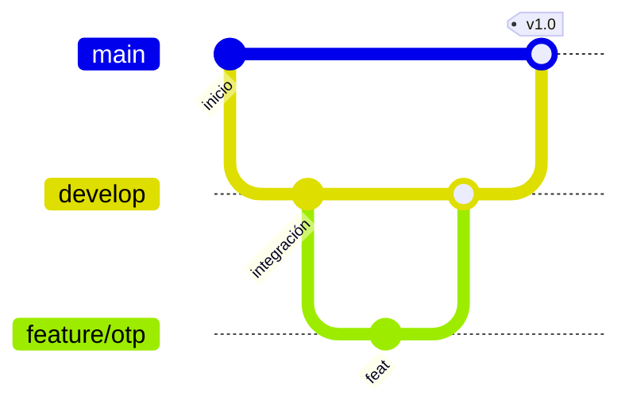

# Metodología de ramas (Gitflow simplificado)

Este repositorio sigue un flujo inspirado en **Gitflow** para el entregable académico y el trabajo en equipo.

## Ramas permanentes

| Rama | Propósito |
|------|-----------|
| `main` | Código estable en producción. Solo entra vía PR desde `develop`. |
| `develop` | Integración continua; dispara deploy a **staging** tras CI verde. |

## Ramas temporales

| Prefijo | Ejemplo | Uso |
|---------|---------|-----|
| `feature/` | `feature/otp-mailbox` | Nueva funcionalidad |
| `fix/` | `fix/session-after-otp` | Corrección de bugs |
| `chore/` | `chore/ci-backend-tests` | CI, docs, refactor sin cambio funcional |

## Flujo recomendado

1. Crear rama desde `develop`: `git checkout -b feature/mi-cambio develop`
2. Commits pequeños y descriptivos en español o inglés consistente.
3. Abrir **Pull Request** hacia `develop`.
4. El workflow **CI Pipeline** ejecuta lint, tests y build.
5. Tras revisión, merge a `develop` → deploy automático a staging (si está configurado en GitHub).
6. Cuando `develop` esté listo para release: PR `develop` → `main` → deploy a producción (con aprobación del environment `production`).

## Convención de commits

- `feat:` nueva funcionalidad
- `fix:` corrección
- `test:` pruebas
- `docs:` documentación
- `chore:` mantenimiento / CI

Ejemplo: `feat(auth): login automático tras verificar OTP`

## Configuración en GitHub

1. Crear rama `develop` desde `main` si aún no existe.
2. En **Settings → Environments**, crear `staging` y `production`.
3. En `production`, activar **Required reviewers** (aprobación manual antes del deploy).
4. Añadir secretos: `AZURE_WEBAPP_PUBLISH_PROFILE`, `STAGING_AZURE_WEBAPP_PUBLISH_PROFILE`.
